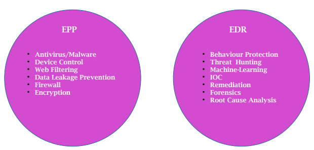
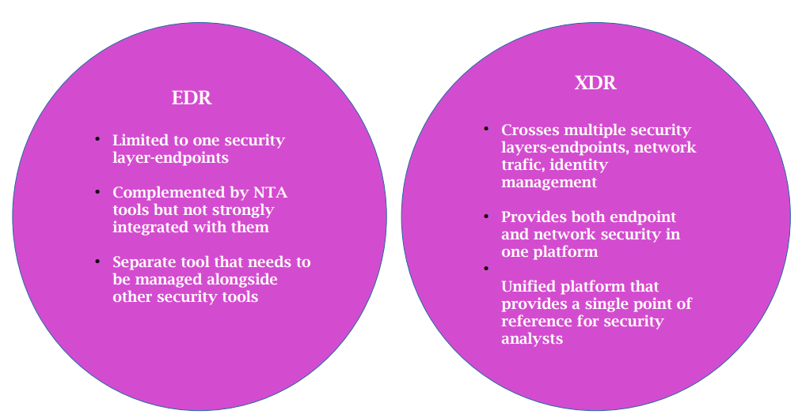

# Solution de détéction et de réponse contre les attaques

## Principales solutions de détection & réponse : EPP, EDR, NDR, XDR, SIEM et SOAR

### EPP – Endpoint Protection Plateform : Détection sur les endpoints basés sur des signatures connues

Quelles sont les technologies utilisées par l'EPP ?

La plate-forme de protection des points finaux fonctionne de manière très similaire à un antivirus. Elle est basée sur une méthode d'analyse par signature à laquelle de nombreuses fonctionnalités et superpositions ont été ajoutées. L'EPP intègre de nouvelles technologies qui lui permettent de mieux protéger une machine contre les attaques de ransomware, par exemple.

L'EPP intègre, en plus de l'analyse de signature et de l'analyse heuristique de l'antivirus, les éléments suivants

    Analyse comportementale : Grâce à un moteur d'apprentissage automatique, l'EPP sera capable d'identifier les actions et les fichiers qui peuvent être considérés comme malveillants.
    Surveillance de la mémoire : Le logiciel de protection va analyser en temps réel pendant l'utilisation d'un programme si ce dernier ne corrompt pas la mémoire du système ou d'un autre programme.
    Vérification des IOC ou indicateur de compromission : l'EPP va identifier sur la machine tout fichier ou clé de registre qui pourrait être lié à une attaque grâce à la threat intelligence (recherche humaine des derniers types d'attaques connues).

EPP est-il suffisant ?

EPP est un logiciel de protection des terminaux de nouvelle génération. Cependant, bien qu'il dispose de nombreuses fonctionnalités, il n'est pas infaillible. En effet, il peut détecter beaucoup plus de malwares qu'un antivirus mais ne les bloque pas et ne détecte pas certains types d'attaques ou de tentatives de corruption du système ou des données. Il reste néanmoins un produit plus pertinent qu'un antivirus pour la protection des ordinateurs et des serveurs.

Traduit avec www.DeepL.com/Translator (version gratuite)

(L’EDR bien plus moderne offre une meilleure protection, des outils de réponse et d’investigation pour un prix similaire. Il est plus intéressant de privilégier l’utilisation d’un antivirus moderne combiné à un EDR.)

Quelques outils EPP
• TEHTRIS EPP
• WatchGuard Endpoint Security (EPP-EDR)
• AhnLab V3 Endpoint Security
• Avast Premium Security
• Avira Antivirus Security
• Bitdefender Endpoint Security Tools
• G DATA Security Client
• McAfee Endpoint Security

### EDR – Endpoint Detection and Response : 
Outil axé sur la détection et l’investigation des machines physiques et virtuelles

C’est l’outil de Detection and Response le plus rentable. L’EDR fonctionne avec un agent installé sur chaque endpoint qui envoie des informations à une plateforme SIEM. Pour un prix raisonnable, il détecte les attaques les plus élaborées à l’aide du machine learning. De plus, l’EDR peut intégrer des actifs avec des caractéristiques variées et offre beaucoup de visibilité sur ces derniers. Par exemple, il est capable d’observer l’historique des processus, les connexions réseaux, les registres, ou encore les utilisateurs connectés. Enfin, il dispose d’options pour bloquer automatiquement les menaces et isoler les machines infectées.

Un EDR entre en action lorsqu'un incident de sécurité s'est déjà produit sur un terminal. Ce dispositif est utilisé pour examiner les dangers et les risques et y répondre. Les autres éléments d'une plateforme EPP sont passifs et servent à prévenir les atteintes à la sécurité des terminaux. L'EDR est un outil actif qui peut aider à identifier les attaques et à lancer des solutions automatisées ou des réponses manuelles.

Les outils EDR remplissent généralement les fonctions suivantes :

     Aider les analystes à identifier les indicateurs de compromission (IoC), en combinant généralement les données collectées à partir des points d'extrémité avec les renseignements sur les menaces ;

     Fournir des alertes en temps réel sur les incidents de sécurité ;

     Intégrer des données médico-légales pour aider les analystes à enquêter sur les points d'extrémité affectés et à identifier la source originale d'une attaque ;

     Remédiation automatique, par exemple en isolant, en effaçant ou en réaménageant un point d'extrémité.

Heimdal Security
Bitdefender
Snort
SentinelOne
Sophos
CrowdStrike
Carbon Black
Cynet 360
Cytomic
Kaspersky
MVISION
Cybereason
ESET

### XDR – Extended Detection and Response : 
Centralise et externalise toute la détection des menaces

Un XDR est une plateforme intégrée de sécurité et de réponse aux incidents qui peut collecter et corréler automatiquement les données provenant des points d'extrémité et de nombreuses autres parties de l'environnement informatique. Il s'agit d'une plateforme permettant d'intégrer les données de sécurité provenant des outils de gestion des informations et des événements de sécurité (SIEM), d'EDR, d'analyse des réseaux et de gestion des identités et des accès (IAM). Elle offre une vue d'ensemble de la cybersécurité de l'ensemble de l'environnement de l'entreprise dans une interface unifiée.

Un XDR peut fournir une normalisation des opérations de sécurité, permettant une analyse cohérente et fiable dans n'importe quel environnement. Elle enrichit les sources de données existantes et consolide les informations pour une analyse plus efficace.

L'objectif ultime de la plateforme XDR est d'améliorer la productivité des équipes de sécurité, de permettre des enquêtes plus rapides et plus complètes, et de réduire les délais de réponse aux incidents.

C’est l’outil le plus complet actuellement sur le marché. Il centralise toute la détection, la réponse à incident, et intègre du marchine learning. L’XDR peut intégrer toutes les sources de log (réseau, endpoints, cloud, emails…). Une équipe externe peut s’occuper d’investiguer et de répondre aux alertes, on parle alors de MDR (Managed Detection and Response). L’outil offre aussi un service de CTI (Cyber Threat Intelligence). Le budget sera souvent le point bloquant, toutefois l’offre est de plus en plus flexible : une entreprise disposant déjà de certaines solutions ou n’ayant pas les fonds pour l’offre complète peut louer une partie des services de l’XDR. Pour les entreprises ne disposant pas d’équipe d’investigation (CSIRT, SOC…) en interne c’est une solution très intéressante. Il est important de garder à l’esprit que l’XDR offre une simplicité de mise en place et une réduction des coûts, mais cela est au détriment de la qualité. La prise en main de l’outils et sa configuration par les équipes internes sera plus complexe.

#### Quelle est la différence entre l'EPP et l'EDR ?

Les solutions EPP constituent la première ligne de défense contre les attaques visant les terminaux. Les solutions EDR sont conçues pour traiter les menaces que les logiciels EPP ne peuvent pas détecter, en aidant à les identifier et à les atténuer après leur apparition.

Par exemple, un logiciel malveillant de type "zero day" ou d'autres menaces avancées peuvent être détectés par un EPP, mais une fois que le terminal est attaqué, il commence à générer une activité inhabituelle. L'EDR peut détecter cette activité, verrouiller automatiquement le point d'extrémité et aider les analystes de sécurité à poursuivre leurs investigations.

III) Quelle est la différence entre EDR et XDR ?

Un XDR permet une détection et une réponse qui vont au-delà de l'approche cloisonnée des outils de sécurité traditionnels, tels que l'EDR. L'EDR est puissant mais finalement limité, car seuls les points d'extrémité gérés avec un agent EDR peuvent être protégés. Cela limite l'éventail des menaces et des attaques contre lesquelles il peut être efficace.

Le système EDR est souvent complété par des outils d'analyse du trafic réseau (NTA), mais ces outils sont limités au réseau et au segment de réseau surveillé. Comme les solutions NTA génèrent un grand nombre de journaux et d'alertes, il est nécessaire d'analyser la relation entre les alertes réseau et les autres données, afin d'identifier les événements de sécurité importants.

Bien que l'industrie ait fait de grands progrès en matière de détection et de réponse, la fonctionnalité EDR a traditionnellement été fournie comme une solution ponctuelle à une couche de sécurité spécifique, et les avantages sont limités à cette couche. XDR permet la détection et la réponse dans une plateforme intégrée et unifiée, ce qui peut donner de bien meilleurs résultats.

### NDR – Network Detection and Response : 
Cet outil analyse le trafic en temps réel pour détecter les premiers signes d’une attaque

En se connectant aux équipements réseaux, cet outil analyse le trafic en temps réel pour détecter les premiers signes d’une attaque et applique des règles de blocage. Il offre peu d’avantages par rapport aux fonctionnalités des pare-feux modernes ou des IDS (systèmes de détection des intrusions) qui peuvent déjà avoir des règles de blocage. La principale différence est la capacité du NDR de déterminer un comportement “normal” de l’ensemble du réseau pour en détecter les écarts. Le bémol porte sur l’investigation des alertes : plus le réseau interne est grand, moins il est possible d’identifier la source de ces alertes. De plus, même si l’IP source est retrouvée, l’outil ne permet pas nécessairement de l’associer à un objet identifiable.

### SIEM – Security Information and Event Management : 
C’est une solution qui permet de centraliser les logs pour investigation et détection

C’est une solution qui permet de centraliser les logs et de les investiguer. En fonction des logs qui lui sont transmis le SIEM pourra détecter des comportements suspects en fonction de règles personnalisables. C’est un outil axé sur l’investigation qui est généralement déjà présent dans les entreprises.

Bien qu’il soit très important pour alerter sur les comportements suspects notamment dans les logs d’utilisations de vos applications internes, il convient dans un premier temps d’avoir un EDR.

**Présentation d'un des outils**

### SOAR – Security Orchestration, Automation and Response : Permet d’automatiser un premier stade d’investigation, et de réponse des alertes.

Le SOAR n’est pas un outil de détection : c’est un outil d’orchestration d’automatisation de la réponse à incident. Sur la base d’alertes, il déclenche une série d’actions à réaliser adaptées à chaque situation. Ces actions peuvent être d’investigation dans le but de compléter les informations de l’alerte, de la contextualiser, mais elles peuvent aussi être de répondre à l’incident. La flexibilité de l’outil fait de lui un réel support pour les analystes.
